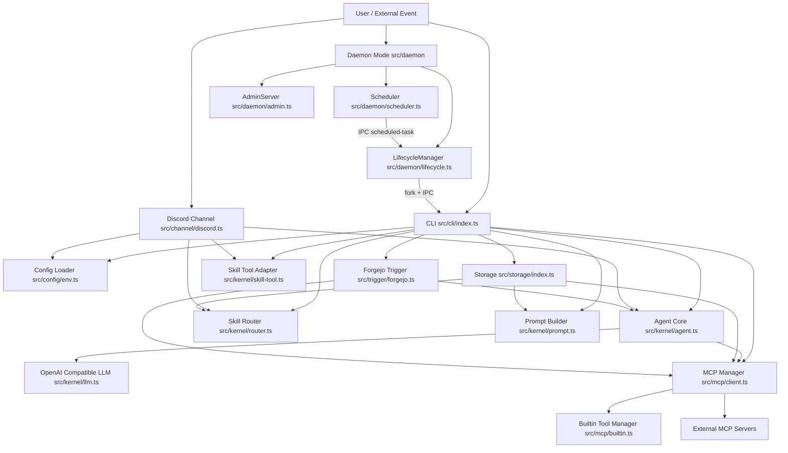
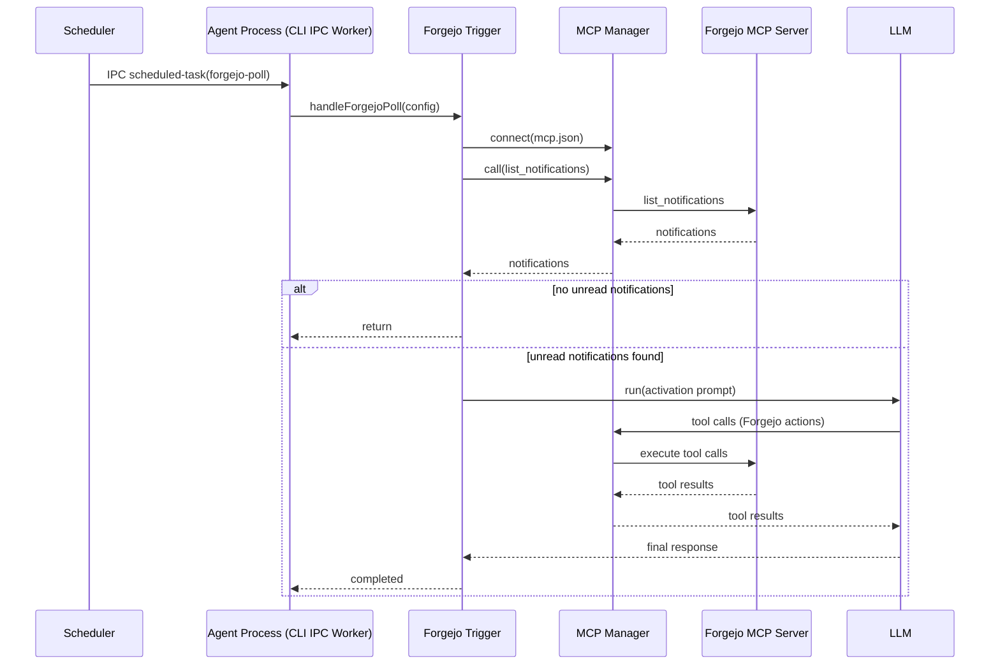

# OpenManbo 项目架构文档

## 1. 架构总览

OpenManbo 是一个以 LLM 为核心的多运行形态智能体系统，主要由以下层次组成：

- 接入层：CLI 命令入口、Discord Bot 通道
- 智能体内核层：会话管理、工具调用循环、技能路由与技能加载
- 工具与扩展层：MCP 客户端聚合、内置工具执行器
- 运行时与运维层：Daemon 进程生命周期管理、调度器、管理 API
- 配置与存储层：环境配置加载、数据目录、身份与技能文档、MCP 配置
- 自动触发层：Forgejo 通知轮询触发器

## 2. 组件关系图

## 3. 核心执行链路

### 3.1 普通对话链路（chat / interactive / Discord）

1. 入口层接收用户输入（CLI 或 Discord）。
2. 读取配置与数据目录内容（IDENTITY、skills、mcp.json）。
3. 初始化 MCP 管理器并连接外部工具服务。
4. 构造系统提示词：基础身份 + 技能目录。
5. 对当前输入做技能路由（显式路由如 /skills，或普通消息）。
6. Agent 发起流式 LLM 对话。
7. 若模型产生工具调用，则由 Agent 循环执行工具并将结果回灌模型。
8. 输出最终回答并在会话中持久化历史。

### 3.2 Daemon 与调度链路

1. daemon 模式启动 LifecycleManager、Scheduler、AdminServer。
2. LifecycleManager 以子进程方式拉起 Agent（fork + IPC）。
3. Scheduler 按间隔发送 scheduled-task 消息。
4. Agent 侧监听 IPC 消息并分发任务（例如 forgejo-poll）。
5. 当 Agent 以退出码 42 退出时，LifecycleManager 执行构建后重启。
6. 构建失败会通过 build-error 消息注入 Agent，支持自愈策略。

### 3.3 Forgejo 自动处理链路

1. 定时任务触发 forgejo-poll。
2. 触发器先用 MCP 工具 list_notifications 轻量探测是否有未读通知。
3. 若有待处理项，创建全新 Agent 会话并注入激活提示词。
4. Agent 通过 Forgejo 相关技能和 MCP 工具完成通知分拣与动作执行。
5. 处理完成后记录日志，等待下一轮调度。

## 4. Daemon 与 Forgejo 时序图

## 5. 目录与职责映射

- src/cli：命令入口，组装配置、存储、MCP 与 Agent
- src/kernel：LLM 客户端、Agent 对话循环、提示词与技能路由
- src/mcp：MCP 多服务连接、工具扁平化暴露、内置执行工具
- src/daemon：子进程生命周期、定时任务、HTTP 管理接口
- src/channel：外部通信通道（当前为 Discord）
- src/storage：.openmanbo 目录读取与 mcp.json 规范化
- src/trigger：由调度触发的自动化任务（当前为 Forgejo 通知）
- src/config：环境变量与运行参数加载
- src/logger.ts：统一结构化日志

## 6. 关键设计点

- 工具调用闭环：Agent 支持多轮 tool call，直到产出最终自然语言结果。
- 运行形态统一：CLI、Discord、触发器均复用同一 Agent 内核与技能机制。
- 可扩展性：通过 mcp.json 可并行挂载多个 MCP 服务，内置工具与外部工具统一暴露。
- 运维可控：Daemon 提供本地管理 API 与重建重启机制，支持崩溃恢复与构建失败反馈。
- 技能治理：技能可被目录发现、按需加载、显式路由，避免将所有规则硬编码到系统提示中。
